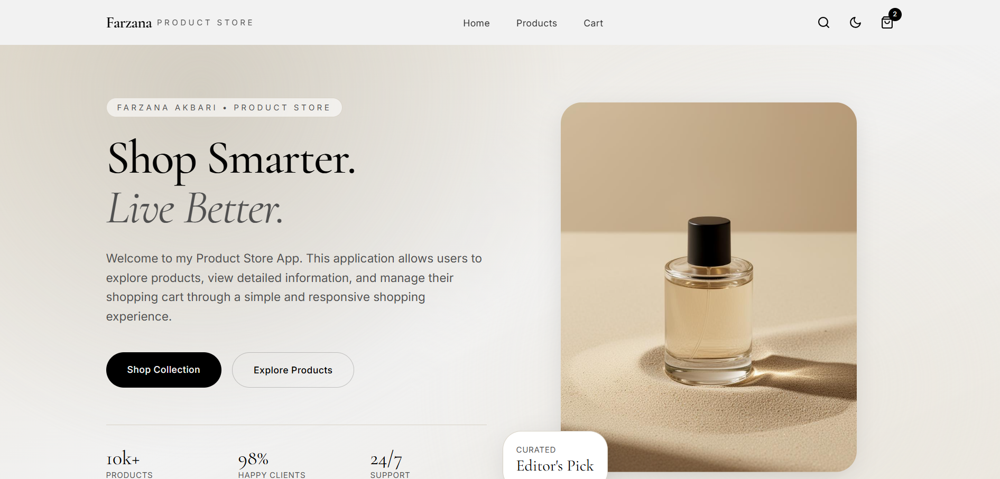
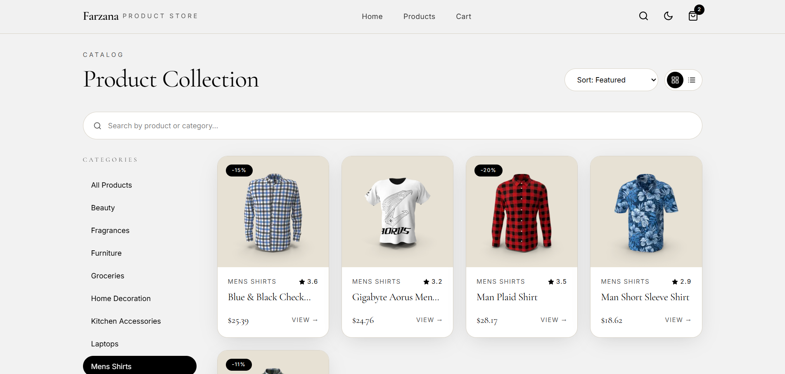
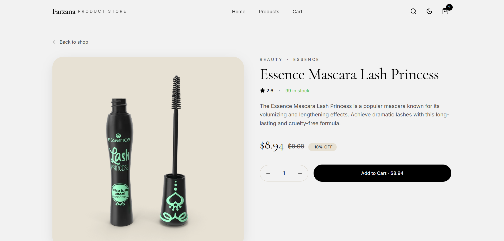
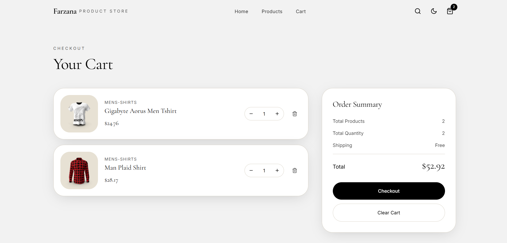

# Farzana Product Store

A React-based e-commerce application built to demonstrate Context API, Redux Toolkit, and React Query in a practical shopping experience.

## Overview

Farzana Product Store is a responsive e-commerce web application that allows users to browse products, view product details, search, filter, sort, and manage a shopping cart. The project was developed to practice modern React state management techniques using Context API, Redux Toolkit, and React Query.

The application demonstrates how different state management solutions can be used for different purposes:

* Context API + useReducer for application settings
* Redux Toolkit for shopping cart management
* React Query for API data fetching and caching

---

## Features

### Product Management

* Display products from an external API
* View detailed product information
* Search products
* Filter products by category
* Sort products by different criteria
* Responsive product grid layout

### Shopping Cart

* Add products to cart
* Remove products from cart
* Increase quantity
* Decrease quantity
* Clear cart
* Display total quantity and total price

### Application Settings

* Light and Dark mode
* Grid and List view
* Category selection

### User Experience

* Responsive design
* Loading states
* Error handling
* Toast notifications
* Smooth animations
* Modern user interface

---

## Technologies Used

### Frontend

* React 19
* TypeScript
* TanStack Router

### State Management

* Context API
* useReducer
* Redux Toolkit
* React Redux

### Data Fetching

* TanStack React Query
* Axios

### Styling & UI

* Tailwind CSS
* Framer Motion
* React Icons
* React Hot Toast

### API

* DummyJSON Products API

---

## State Management Implementation

### Context API + useReducer

Context API and useReducer are used to manage application settings such as:

* Theme mode
* Layout view
* Selected category

This allows settings to be shared across multiple components without prop drilling while keeping the state logic organized through reducer actions.

### Redux Toolkit

Redux Toolkit is used for shopping cart management because the cart contains multiple actions and needs to be accessible throughout the application.

Cart features managed by Redux Toolkit include:

* Add item
* Remove item
* Increase quantity
* Decrease quantity
* Clear cart
* Calculate totals

### React Query

React Query is used for handling product data fetched from the API.

Benefits include:

* Data caching
* Loading state management
* Error handling
* Automatic refetching
* Improved performance

---

## Folder Structure

```text
src/
├── components/      Reusable UI components
├── context/         SettingsContext + settingsReducer
├── redux/           store.ts + cartSlice.ts
├── hooks/           Custom React Query hooks
├── services/        API requests
├── routes/          Application routes
├── utils/           Helper functions
└── styles.css
```

---

## Installation

Clone the repository:

```bash
git clone https://github.com/Farzana921/farzana-product-store-final.git
```

Navigate to the project folder:

```bash
cd farzana-product-store-final
```

Install dependencies:

```bash
npm install
```

Start the development server:

```bash
npm run dev
```

---

## Screenshots

### Home Page



### Product List



### Product Details



### Shopping Cart



---

## Learning Outcomes

Through this project I gained practical experience with:

* Managing global state using Context API and Redux Toolkit
* Using reducers to organize state updates
* Fetching and caching API data with React Query
* Building reusable React components
* Creating responsive user interfaces
* Structuring React applications using a scalable folder organization

---

## Future Improvements

Possible future enhancements include:

* User authentication
* Wishlist functionality
* Product reviews and ratings
* Checkout process
* Payment integration
* Order history
* Pagination and infinite scrolling

---

## Author

**Farzana Akbari**

Created as part of a React State Management assignment to demonstrate the practical use of Context API, useReducer, Redux Toolkit, and React Query.
